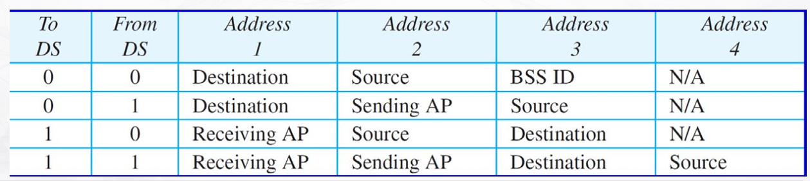
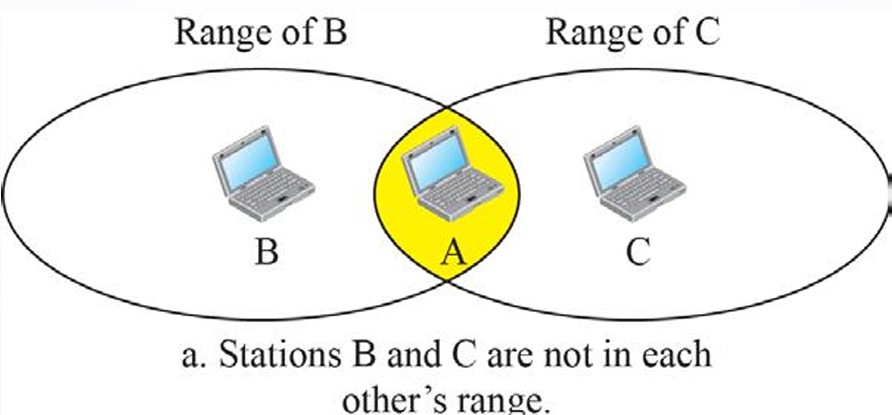
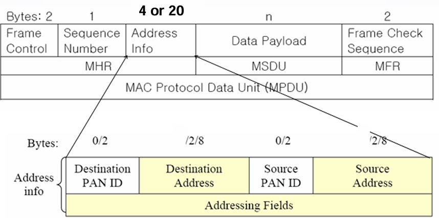
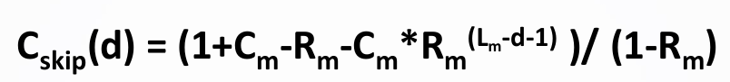

# week14 wifi zigbee

## wifi
- IEEE 표준 : 802.11
- 구성
    - ``AP`` : 유무선 공유기
    - ``STA``(Station) : 기기 ex) 노트북, 스마트폰...
- Service Set
    - ``BSS``(Basic Service Set)
        - AP와 STA로 구성된 집합의 명칭
        - BSS-ID : BSS에 구성된 AP의 MAC address
        - AP 거치지 않고 통신 -> ad hoc (1대1통신, 디바이스 설정할때)
        - AP 통해서 통신-> infrastructure
    
    - ``ESS``(Extended Service Set)
        - 두개 이상의 BSS로 구성
- MAC
    - ``PCF``(Point coordination function)
        - 중앙집중식 Polling 방식 사용

    - ``DCF``(Distributed coordination function)
        - CSMA/CA, station에서 사용
- CSMA/CA(CD)
    - ``CS``(Carrier Sense) : 네트워크가 현재 사용중인지 확인
    - ``MA``(Multiple Access) : 네트워크가 비어있다면 누구나 사용가능
    - ``CA``(Collision Avoidance) : 충돌 회피
        - RTS(Request To Send) : 전송해도 되겠니?
        - CTS(Clear To Send) : 전송해도 돼.
    - ``CD``(Collision Detection) : 충돌 감지(유선)
    - Hidden Terminal Problem
    
## zigbee
- IEE 표준 : 802.15.4
- 물리 계층
    - ``3``개의 밴드 ``27``개의 채널
    - DSSS(Direct Sequence Spread Spectrum)
- MAC 계층
    - ``NC``(Network Coordinator)
    - ``FFD``(Full Function Device) : 전기능기기
    - ``RFD``(Reduced Function Device) : 축소기능기기
- MAC 의 통신 방법
    - ``Beacon`` 통신 : Slotted CSMA-CA 통신, ``슈퍼프레임``, 복잡함, sleep기능 쉬움
        - ``슈퍼프레임``
            - 최대 16개의 슬롯으로 구성됨
            - 항상 비콘으로 시작됨(``GTS``가 어느 기기에 할당되어 있는지 알려준다다)
            - Beacon : NC(Network Coordinator)가 송신.
            - ``CFP`` : 경쟁이 없는 구간, 반드시 받아야 할 데이터가 위치해있음. 0~7개슬롯 할당가능
            - ``CAP`` : 경쟁이 있는 구간, 그나마 덜 중요한 데이터가 위치해있음.
    - ``Non-Beacon`` 통신 Non-Slotted SMA-CA 통신, 수신 확인 응답, 간단함, sleep기능 어려움
- MAC 프레임 종류
    - 비콘 frame
    - ``데이터 프레임``
        - 상위 계층에 전달
    - 확인 프레임
    - MAC 명령 프레임
        - MAC 계층 간에 전달

- MAC 프레임 中 ``데이터 프레임``
    
    - 데이터 송수신에 사용되는 프레임
    - Frame control : Frame type, 주소형식등 Frame에 관한 정보, ``2bytes``
    - Sequence Number : Frame의 일련번호, ``1bytes``
    - Payload : 실제 데이터, ``n bytes``
    - Frame check Sequence : frame error check, ``2bytes``
    - **``Address info``** : 주소 정보, ``4 or 20 bytes``
        - PAN ID + Address로 구성된다.
        - ``PAN ID`` : 네트워크주소, 코디네이터(NC)가 할당한 ID, 2bytes
        - ``Address`` : 2 or 8 bytes.
            1. ``Short Address`` : 코디네이터로 부터 할당받은 주소, 2bytes
            2. ``Extended Address`` : 각 장비의 고유한 주소, 8bytes
        - 서로 같은 네트워크 일때 : PAN ID 생략, 내주소(2), 상대주소(2) -> ``4bytes``
        - 다른 네트워크 일때 : 목적지, 근원지 PAN ID(2, 2), 내주소(2, 8), 상대주소(2, 8) -> 8 or ``20bytes``

- 코디네이터(NC)가 주소를 할당하는 방식
    - ``중앙`` 집중 할당 기법
        - 하나의 노드가 모든 기기의 주소를 할당함.
    - ``분산`` 주소 할당 기법
        - 16비트 주소 할당기법
        - 각각의 zigbee 노드가 자식 노드에게 주소를 할당가능.
        - **네트워크 상의 트래픽을 줄일 수 있다!!!**
        - 할당 방법
            - 
            - Cm : 최대자식 개수
            - Lm : 네트워크 트리의 최대 깊이
            - Rm : 자식의 최대 개수
            - d : 현재 노드의 깊이

    